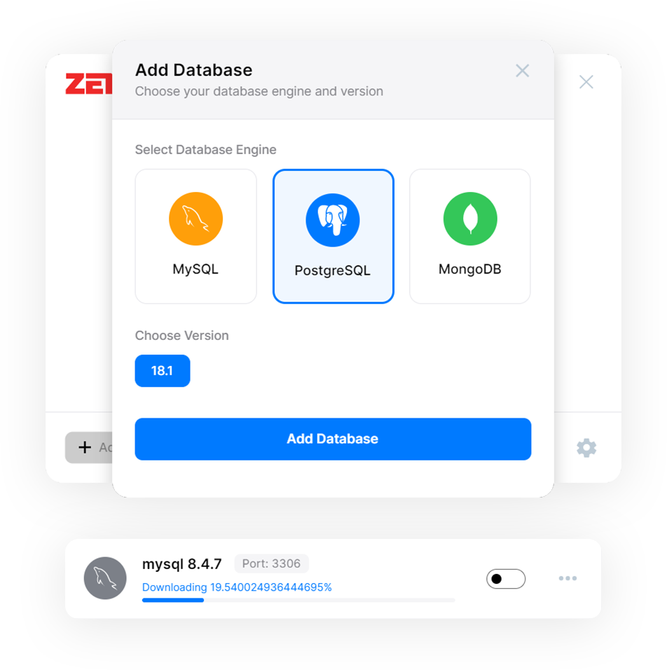
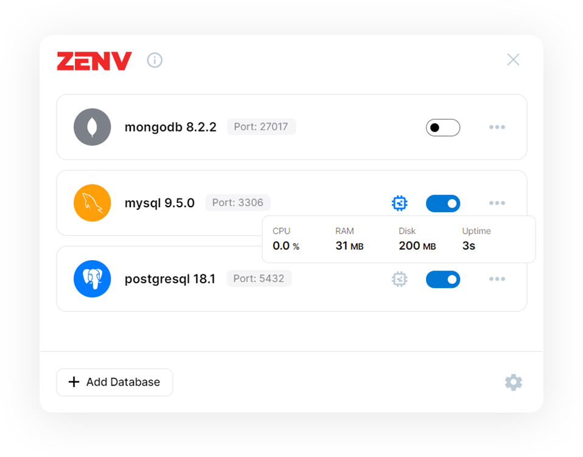
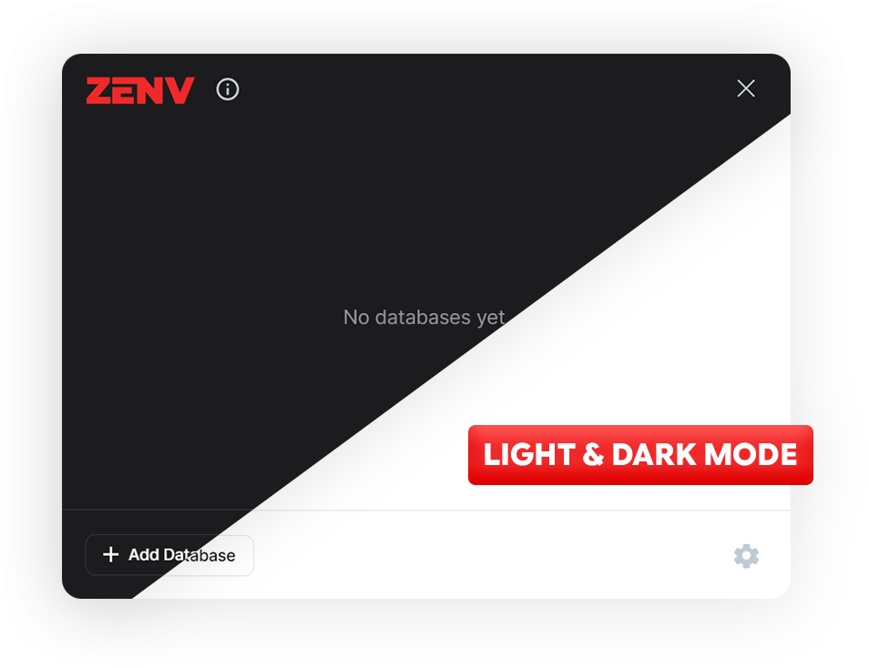

# ZenvDB 🚀

<div align="center">

**The Zen Way to Manage Local Databases**

<p align="center">
  <a href="#-features">Features</a> •
  <a href="#-how-it-works">How It Works</a> •
  <a href="#-configuration">Configuration</a> •
  <a href="#-monitoring">Monitoring</a>
</p>

</div>

---

**ZenvDB** is a modern, lightweight tool designed to take the headache out of local database management. Forget about complex installers, services, and configuration files. With ZenvDB, you just pick your database, and we handle the rest.

## ✨ Features

### 🔄 Fully Automated Setup
Stop wasting time with manual installations.
1. Go to **Add Database**.
2. Select your engine (MySQL, PostgreSQL, MongoDB).
3. Pick a version.
4. **ZenvDB does the rest**: It downloads the binaries, unzips them, and configures the environment automatically.



### 📊 Real-Time Resource Monitoring
Keep an eye on your database performance without external tools. ZenvDB provides real-time metrics for every running instance:
- **CPU Usage**: Track processor load.
- **RAM Usage**: Monitor memory consumption.
- **Disk Usage**: See how much space your data is taking.



### � Portable & Zero Installation
ZenvDB is completely portable. There is **no installation required**.
- **Run Anywhere**: Works on any machine with Windows.
- **No Admin Rights**: You don't need administrator privileges to run it.
- **USB Ready**: Carry it on a USB drive and have your databases ready to go instantly.

### �🎨 Modern & Adaptive UI
Built with **AvaloniaUI**, ZenvDB looks great on Windows 10 and 11. It features a sleek design that adapts to your workflow, including full support for **Light and Dark modes**.



---

## 🛠 How It Works

ZenvDB keeps your system clean by isolating database binaries and data.

### 📂 Smart Directory Structure
- **`engines/`**: The application downloads and extracts database binaries here. This keeps your global PATH clean.
- **`data/`**: All actual database data is stored here. This means you can delete or upgrade an engine version without losing your data.

### ⚙️ Dynamic Configuration (`engines.conf`)
We don't lock you into specific versions. ZenvDB reads available versions from a simple text file: `engines.conf`.

**Want a specific version of MySQL or PostgreSQL?**
Just edit `engines.conf` and add it!

```ini
# Format: engine-version=download_url
mysql-8.4.7=https://dev.mysql.com/get/Downloads/MySQL-8.4/mysql-8.4.7-winx64.zip
postgresql-18.1=https://sbp.enterprisedb.com/getfile.jsp?fileid=1259825
mongodb-8.2.2=https://fastdl.mongodb.org/windows/mongodb-windows-x86_64-8.2.2.zip
```

The application parses this file at startup, giving you total control over what versions are available for download.

---

## 🚀 Getting Started

1. **Download** the latest release.
2. **Run** `ZenvDB.exe`.
3. **Click** the "+" button to add your first database.
4. **Relax** while ZenvDB sets it up.


## ☕ Support the Project

If you find ZenvDB useful and want to support its development, you can contribute via PayPal:

<a href="https://PayPal.Me/zncodex">
  
</a>

<div align="center">
  <sub>Built with ❤️ for developers who love simplicity.</sub>
</div>

